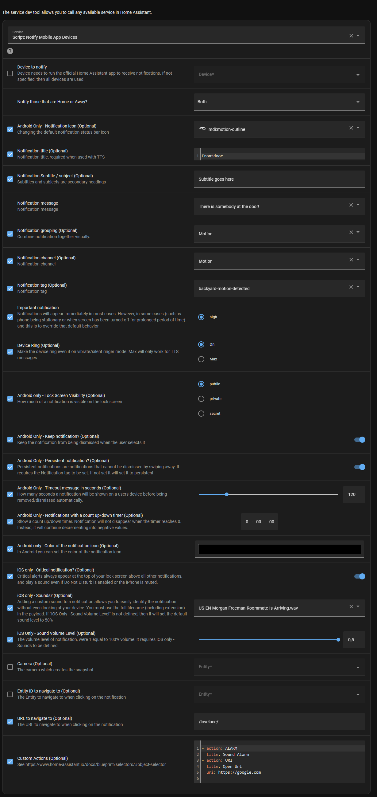

# Home-Assistant-Notify-Mobile-Companion-App-Devices
**Struggling to make use of the notification options of the [Home Assistant Companion App](https://companion.home-assistant.io) on your mobile device? Then this script can help you in the right direction.**

Ever gone through all of the options of the [Companion app](https://companion.home-assistant.io/docs/notifications/notifications-basic)?, then you may have lost your self :thinking: in all of the options you can pick you might be dazzled :dizzy_face: what you can do with it, let alone reapply it in another automation :confused:.

And so I noticed over the last year or so that I made more and more use of the notifications via the Home Assistant Companion App on the various mobile devices, and I loved it so much that I applied it for many automations. During that journey I was struggling with adding and fixing the code in various automations (there are +/- 40 automations where I was using it) so maintaining all of it was a nightmare. And thus I made one script that has all the logic in it to notify all or specific devices, which have the app installed, and let the automation call the script. And meanwhile use the [selectors](https://www.home-assistant.io/docs/blueprint/selectors) to have a UI to guide the process with all sorts of options.



***Note***
*Most of our mobile devices at home are Android based, so the script is build to favour Android, but there are various options for the iOS users :nerd_face:.*

I tried to add as many options as I went along (all options are from the [Introduction | Home Assistant Companion Docs](https://companion.home-assistant.io/docs/notifications/)), but not every thing is there (yet), but it should get you quite far (hopefully :smiley: ).

## Where to start?
+ First thing is of course following the [Getting Started](https://companion.home-assistant.io/docs/getting_started/) to configure and install the Home Assistant Companion App
+ Once the Home Assistant Companion App is installed and connected you should have a devices in the [Integrations section](https://www.home-assistant.io/integrations/mobile_app/)


## Then what?
+ Go to the Settings → Automations & Scenes → Scripts and add/save the script [](https://my.home-assistant.io/redirect/scripts/)
+ Go to the Developer Tools → Services and test the script [](https://my.home-assistant.io/redirect/developer_services/)
  + Use the 'Go to YAML mode' and click on the "Fill example data" to send notification example to all mobile devices :nerd_face:
  + Try out the examples (at the end of this article)
+ Use the script in your automation to send notifications to your mobile device :partying_face: :partying_face: :partying_face:

## Usefull examples

### Example 1: Send a persistent notification, that the user can’t remove
```
service: script.notify_devices
data:
  notify_home_or_away: Both
  data_notification_icon: mdi:human-greeting-variant
  notify_title: Example 1
  notify_message: Send a persistent notification, that the user can't remove
  data_group: Example
  data_tag: Use this tag when you need to remove it
  data_importance: high
  data_sticky: true
  data_persistent: true
```
### Example 2: Send a clean_persistent notification, so the notification is removed
```
service: script.notify_devices
data:
  notify_home_or_away: Both
  data_tag: Use this tag when you need to remove it
  data_importance: high
  notify_message: clear_notification
```
### Example 3: Send a persistent notification, that the user can’t remove, but automatically is removed
```
service: script.notify_devices
data:
  notify_home_or_away: Both
  data_notification_icon: mdi:human-greeting-variant
  notify_title: Example 3
  notify_message: Send a persistent notification, that the user can't remove
  data_group: Example
  data_tag: Use this tag when you need to remove it
  data_importance: high
  data_sticky: true
  data_persistent: true
  data_timeout: 30
```

I hope that it helps you as much as it did for me :robot:. Happy notifying!
